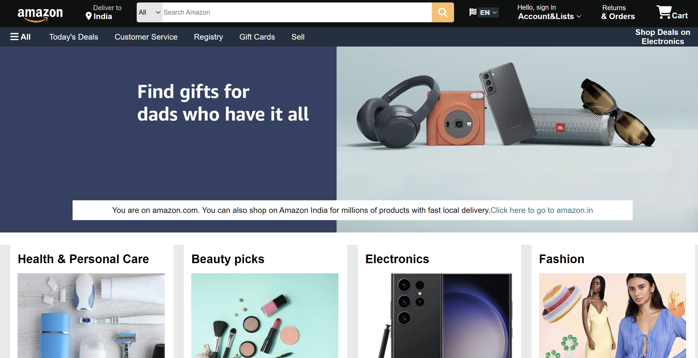
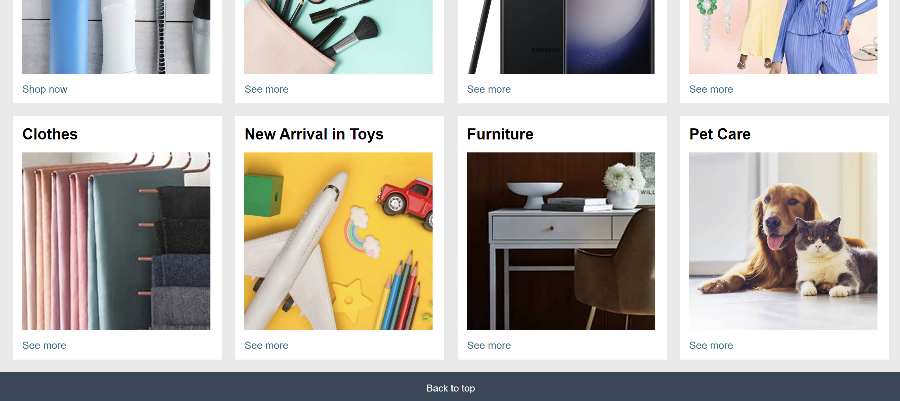
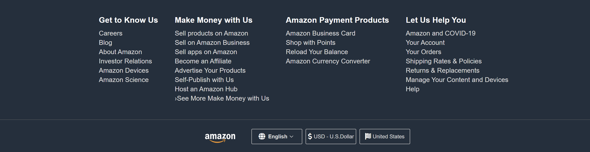

# Amazon UI Clone
<div align="justify">
A visually accurate clone of Amazon's user interface built using **HTML** and **CSS**. This project replicates the design and layout of the Amazon homepage and product listing pages, with a focus on clean structure and responsive design. **Font Awesome** is used to implement icons, enhancing the user interface.
</div>
## Table of Contents

- [Project Description](#project-description)
- [Features](#features)
- [Technologies Used](#technologies-used)
- [Getting Started](#getting-started)
- [Installation](#installation)
- [Usage](#usage)
- [Project Structure](#project-structure)
- [Screenshots](#screenshots)
- [Contact](#contact)

## Project Description

The Amazon UI Clone is a static replica of the Amazon website, focusing on the front-end design using only **HTML** and **CSS**. This project includes the homepage layout, navigation bar, footer, and product listing sections. **Font Awesome** is utilized for icons such as cart, search, and other action buttons.

## Features

- **Responsive Design**: The layout is optimized for different screen sizes (desktop, tablet, and mobile).
- **Static Pages**: Includes homepage and product listing page mockups.
- **Font Awesome Integration**: Icons for buttons, navigation, and more.
- **Navigation Bar**: Replicates the Amazon header with a functional structure.
- **Product Grid**: Displays products in a grid format, closely mimicking Amazon’s style.

## Technologies Used

- **HTML5**: For structuring the web pages.
- **CSS3**: For styling and creating a responsive layout.
- **Font Awesome**: For adding icons to enhance the UI.

## Getting Started

To get a local copy of this project up and running, follow these steps.

### Prerequisites

You only need a modern web browser like Chrome, Firefox, or Edge.

### Installation

1. **Clone the repository**:

    ```bash
    git clone https://github.com/your-username/amazon-ui-clone.git
    ```

2. **Navigate to the project directory**:

    ```bash
    cd amazon-ui-clone
    ```

3. **Open the project in your browser**:

    Simply open `index.html` in your browser by double-clicking the file or right-clicking and selecting "Open with."

### Usage

- Browse through the homepage to explore the header, search bar, and product grid.
- Check out the responsive layout by resizing the browser window or testing on different devices.

## Project Structure

```bash
amazon-ui-clone/
├── index.html         # Main HTML file for the homepage
├── styles.css     # Main CSS file for styling
└── images/
    └── logo.png,... etc       # Amazon logo and other images
```

## Screenshots





## Contact
**Kuruva Abhinav**
<br>
GitHub: Abhinav-Kuruva
<br>
Email: abhinavkuruva259@gmail.com


